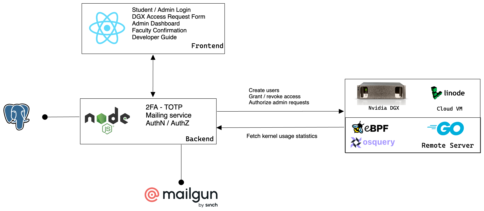

# Dwarpaal - A digital gatekeeper for DGX

## Background

VJTI CoE (Centre of Excellence) hosts an Nvidia DGX system that serves as the primary compute for CPU and GPU-intensive workloads. In order to avail its large computing resources for academic research, students request access to the DGX system of servers to Infrastructure Heads of the CE & IT Department and their concerned project mentor.

## Drawbacks

- Lot of manual labor required for account creation and credential generation. Currently the process of requesting access is via a pen-and-paper form that requires signatures of Infrastructure Heads and the project mentor.

- No unified view for the faculty to check which student has what privileges to the system and for how long.

- Lack of proper documentation to use the DGX, esp. for deep learning workloads.

- Grafana dashboards currently used for visualization do not provide GPU, memory, and disk usage statistics.

## Proposed Solution

In order to improve accessibility of DGX and to monitor its computing resources, Dwarpaal is a web portal that provides a unified view of kernel usage statistics to the admin, simplifies the process of user access.

## System Architecture

## Screenshots

> Made with ❤️ by Team NAVNAVTITHI++ for the Digital Campus Hackathon - celebrating 100 years of our VJTI Matunga campus 💯
